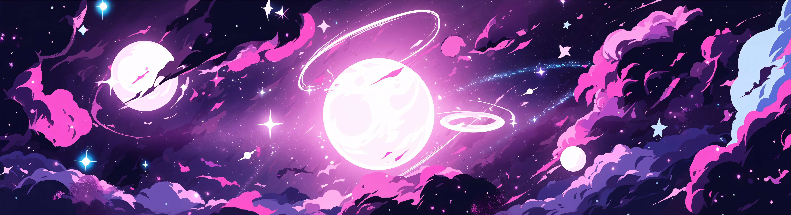

 

* Curso **Análise e Desenvolvimento de Sistemas** na **Universidade Católica de Brasília**.
* Meu objetivo é ser concursado na área.

 

  
  

     

 

> _"Viva sua vida, é sua de qualquer maneira."_ 💟  
> — **BTS**

 
 

      

## Minhas habilidades

<!-- Front-end -->
  
  
  
  
  
  
  
  <!-- Linguagens -->
  
  
  

  <!-- Ferramentas -->
  

  

 

<picture>
  <source media="(prefers-color-scheme: dark)" srcset="https://raw.githubusercontent.com/Louvpiie/Louvpiie/output/pacman-contribution-graph-dark.svg">
  <source media="(prefers-color-scheme: light)" srcset="https://raw.githubusercontent.com/Louvpiie/Louvpiie/output/pacman-contribution-graph.svg">
  
</picture>

 
 

      

 

  

